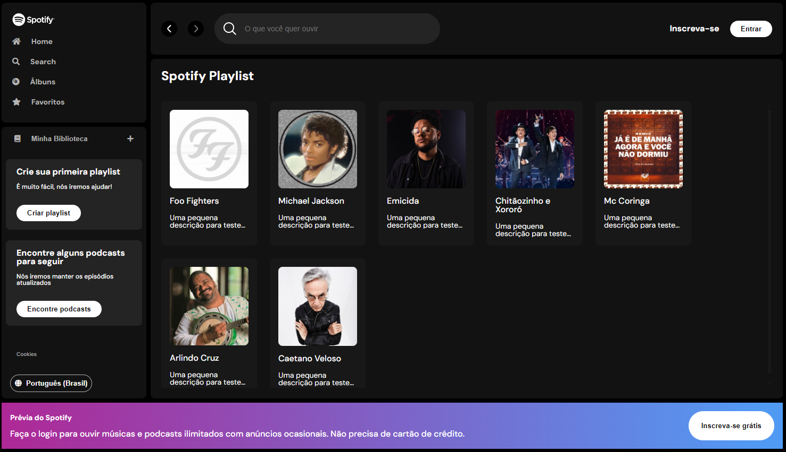

# Spotify Clone

Este é um projeto inspirado no visual do Spotify, desenvolvido durante a Imersão Front-End da Alura.

## Preview

## Descrição

O projeto consiste em um clone do Spotify, utilizando HTML, CSS e JS a aplicação front-end. O objetivo é criar uma interface semelhante ao Spotify, onde é possível visualizar artistas e suas informações.

## Funcionalidades

- Busca de artistas por nome
- Exibição dos artistas encontrados em formato de cards
- Armazenamento dos dados no LocalStorage para evitar requisições desnecessárias à API

## Tecnologias utilizadas

- HTML
- CSS
- JavaScript

## Link do projeto

[Clique aqui para visitar o projeto!](https://imersao-dev-alura.netlify.app/)

## Como executar o projeto

1. Clone este repositório
2. 2. Abra o projeto no VSCode
3. Instale o json-server com o comando `npm i json-server`
4. No terminal do VSCode, inicie o json-server com o comando `json-server --watch api-artists/artists.json` 
5. Inicie o index.html com o live server

## Autor

Felipe Diego Tamura

## Licença

Este projeto está sob a licença MIT. Consulte o arquivo LICENSE para mais informações.# Spotify Clone
